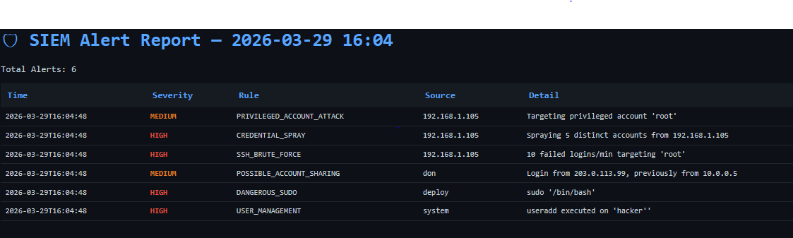

# 🛡️ SIEM Lite — Real-Time Log Analysis & Alerting


> A lightweight, single-file Python SIEM engine that ingests Linux auth logs, syslog, Apache/Nginx access logs, and iptables logs — detecting brute-force attacks, credential spraying, privilege escalation, web attacks, and anomalous logins in real time. Sends alerts to the terminal, a log file, Slack, or email, and generates a styled HTML incident report.

---

## Screenshot



---

## 📌 Table of Contents

- [Overview](#overview)
- [Features](#features)
- [How It Works](#how-it-works)
- [Detection Rules](#detection-rules)
- [Installation](#installation)
- [Usage](#usage)
- [Sample Output](#sample-output)
- [HTML Report](#html-report)
- [Project Structure](#project-structure)
- [Skills Demonstrated](#skills-demonstrated)
- [Future Improvements](#future-improvements)
- [Author](#author)

---

## Overview

SIEM Lite simulates the core functions of enterprise SIEM platforms (like Splunk or IBM QRadar) in a single Python script. It operates in two modes:

- **`--watch`** — tails one or more live log files in real time, processing new lines as they arrive
- **`--parse`** — performs a one-shot analysis of a static log file, then exits

All parsed events pass through a rule evaluator that applies threshold-based and pattern-based detection logic. When a rule triggers, a `SIEMAlert` is raised and dispatched — to the terminal, `siem.log`, and optionally Slack or email.

---

## Features

| Feature | Detail |
|---|---|
| 📥 Log Ingestion | Auth logs, syslog, Apache/Nginx access logs, iptables logs |
| 🔍 Regex Parsing | 8 compiled patterns covering SSH, HTTP, sudo, user mgmt, firewall |
| 🚨 Threat Detection | 12 detection rules across 4 threat categories |
| 📊 HTML Report | Dark-themed, colour-coded incident report saved to disk |
| 📧 Email Alerting | SMTP-based alerts for HIGH / CRITICAL events |
| 💬 Slack Alerting | Webhook-based Slack notifications for HIGH / CRITICAL events |
| ⏱️ Real-Time Watch | Tail-based log polling with configurable interval |
| 🔁 Alert Deduplication | Suppresses repeated alerts for the same rule/IP within 120 seconds |
| 🧮 Rolling Statistics | Per-IP failure rates computed over a 60-second sliding window |
| 📦 Zero Dependencies | Built entirely on the Python standard library |

---

## How It Works

```
┌──────────────────┐
│   Log Files       │  (auth.log / syslog / access.log / iptables)
└────────┬─────────┘
         │ raw lines
         ▼
┌──────────────────┐
│   LogParser       │  Applies regex patterns → structured event dicts
└────────┬─────────┘
         │ events
         ▼
┌──────────────────┐     ┌────────────────┐
│  StatTracker      │◄────│ RuleEvaluator  │  Threshold & pattern checks
│  (rolling stats)  │     └───────┬────────┘
└──────────────────┘             │ SIEMAlert
                                  ▼
                        ┌──────────────────┐
                        │  AlertEngine      │  Dedup → log / Slack / email
                        └──────────────────┘
                                  │
                                  ▼
                        ┌──────────────────┐
                        │ ReportGenerator   │  HTML incident report
                        └──────────────────┘
```

### Components

| Class | Responsibility |
|---|---|
| `LogParser` | Matches raw log lines against 8 compiled regex patterns and returns structured event dicts |
| `StatTracker` | Maintains rolling per-IP counters for SSH failures, HTTP errors, and login history |
| `RuleEvaluator` | Applies all detection rules to each parsed event |
| `AlertEngine` | Deduplicates alerts, logs them, and dispatches Slack/email notifications |
| `SIEMAlert` | A single security event with timestamp, rule name, severity, source, and detail |
| `LogWatcher` | Polls log files for new lines using file offset tracking (tail-like) |
| `ReportGenerator` | Renders a dark-themed HTML table of all fired alerts |

---

## Detection Rules

### 🔐 Authentication & SSH

| Rule | Severity | Trigger |
|---|---|---|
| `SSH_BRUTE_FORCE` | HIGH | ≥ 10 failed SSH logins from the same IP within 60 seconds |
| `CREDENTIAL_SPRAY` | HIGH | Failed logins targeting ≥ 5 distinct accounts from one IP |
| `PRIVILEGED_ACCOUNT_ATTACK` | MEDIUM | Any failed login targeting `root`, `admin`, or `administrator` |
| `AFTER_HOURS_LOGIN` | MEDIUM | Successful SSH login between 22:00–24:00 or before 06:00 |
| `POSSIBLE_ACCOUNT_SHARING` | MEDIUM | Same user logs in successfully from two different IPs |

### ⚙️ Privilege Escalation

| Rule | Severity | Trigger |
|---|---|---|
| `DANGEROUS_SUDO` | HIGH | `sudo` command containing shells, `chmod 777`, `visudo`, `nc`, `/etc/passwd`, or `python` |
| `USER_MANAGEMENT` | HIGH / MEDIUM | Execution of `useradd`, `userdel` (HIGH) or `usermod`, `groupadd`, `passwd` (MEDIUM) |

### 🌐 Web Attack Detection

| Rule | Severity | Trigger |
|---|---|---|
| `HTTP_BRUTE_FORCE` | HIGH | ≥ 100 HTTP 401/403 responses from one IP within 60 seconds |
| `SQL_INJECTION_ATTEMPT` | HIGH | SQLi patterns in request path (`'`, `1=1`, `UNION SELECT`, `OR 1=1`, `--`, `;DROP`) |
| `XSS_ATTEMPT` | MEDIUM | XSS patterns in request path (`<script`, `javascript:`, `onerror=`, `onload=`) |
| `PATH_TRAVERSAL` | HIGH | Directory traversal patterns (`../`, `..\`, `%2e%2e`) |

### 🔥 Network / Firewall

| Rule | Severity | Trigger |
|---|---|---|
| `FIREWALL_DROP` | LOW | iptables DROPPED packet logged |

---

## Installation

No third-party packages are required. SIEM Lite runs on the **Python standard library only**.

```bash
# 1. Clone the repository
git clone https://github.com/Don-cybertech/04_siem_lite.git
cd 04_siem_lite

# 2. Confirm Python version (3.8+ required)
python3 --version

# 3. Run directly — no pip install needed
python3 siem_lite.py --help
```

---

## Usage

### Watch live log files (real-time mode)

```bash
python3 siem_lite.py --watch /var/log/auth.log /var/log/syslog
```

### Watch an Nginx access log

```bash
python3 siem_lite.py --watch /var/log/nginx/access.log --format nginx
```

### Parse a static log file once and exit

```bash
python3 siem_lite.py --parse /var/log/auth.log
```

### Parse and save an HTML report

```bash
python3 siem_lite.py --parse /var/log/auth.log --report report.html
```

### Watch with Slack and email alerting

```bash
python3 siem_lite.py --watch /var/log/auth.log \
  --email admin@example.com \
  --slack https://hooks.slack.com/services/YOUR/WEBHOOK/URL
```

### CLI Reference

| Argument | Description |
|---|---|
| `--watch FILE [FILE ...]` | One or more log files to monitor in real time |
| `--parse FILE` | Parse a single log file once and exit |
| `--format` | Log format hint: `auto`, `syslog`, `nginx`, `apache` (default: `auto`) |
| `--report HTML` | Output path for the HTML incident report |
| `--email ADDRESS` | Recipient email for HIGH/CRITICAL alerts (requires local SMTP) |
| `--slack URL` | Slack webhook URL for HIGH/CRITICAL alerts |

---

## Sample Output

```
2025-04-12 10:31:00,000 [INFO] Watching 2 log file(s) — Ctrl+C to stop

2025-04-12 10:32:14,201 [WARNING] [MEDIUM] PRIVILEGED_ACCOUNT_ATTACK | 192.168.1.105 | Targeting privileged account 'root'
2025-04-12 10:32:16,450 [WARNING] [HIGH] SSH_BRUTE_FORCE | 192.168.1.105 | 10 failed logins/min targeting 'root'
2025-04-12 10:32:16,451 [WARNING] [HIGH] CREDENTIAL_SPRAY | 192.168.1.105 | Spraying 5 distinct accounts from 192.168.1.105
2025-04-12 10:45:03,112 [WARNING] [HIGH] SQL_INJECTION_ATTEMPT | 10.0.0.22 | SQLi in: /login?id=1' OR 1=1--
2025-04-12 10:50:20,309 [WARNING] [HIGH] DANGEROUS_SUDO | deploy | sudo '/bin/bash'

2025-04-12 11:00:00,000 [INFO] Stopped.
2025-04-12 11:00:00,100 [INFO] Report saved → incident.html
```

Alert severity icons:

| Icon | Severity |
|---|---|
| `i` | LOW |
| `!` | MEDIUM |
| `!!` | HIGH |
| `!!!` | CRITICAL |

---

## HTML Report

When `--report` is specified, SIEM Lite generates a dark-themed HTML incident report:

- Colour-coded severity column (green → orange → red → purple)
- Timestamp, rule name, source IP/user, and event detail for each alert
- Total alert count displayed at the top
- Auto-saved at the end of `--parse` or on Ctrl+C during `--watch`

---

## Project Structure

```
04_siem_lite/
├── siem_lite.py           # Entire SIEM engine (single file)
├── sample_auth.log        # Sample log file for testing
├── report_screenshot.png  # Screenshot of the HTML report
├── siem.log               # Runtime log output (auto-created)
├── report.html            # HTML incident report (generated on demand)
└── README.md
```

---

## Skills Demonstrated

- **Log Parsing** — Regex-based extraction of structured data from raw Linux/web log formats
- **Threat Detection** — Threshold-based (rolling window) and signature-based (pattern) detection
- **Object-Oriented Design** — Seven well-scoped classes with clean separation of concerns
- **Alert Pipeline** — Deduplication, severity triage, and multi-channel dispatch (log, email, Slack)
- **File I/O & Polling** — Offset-based tail implementation without external libraries
- **Report Generation** — Programmatic HTML generation with inline CSS theming
- **Standard Library Mastery** — `re`, `collections`, `smtplib`, `urllib`, `argparse`, `pathlib`, `logging`

---

## Future Improvements

- [ ] Windows Event Log (`.evtx`) support via `python-evtx`
- [ ] SQLite storage for persistent event querying
- [ ] Interactive web dashboard (Flask)
- [ ] GeoIP lookup for source IPs
- [ ] Machine learning-based anomaly detection
- [ ] YAML-based rule configuration (no code edits needed)
- [ ] Export report to PDF

---

## Author

**Egwu Donatus Achema** 

Cybersecurity Analyst | Python Developer

- GitHub: [@Don-cybertech](https://github.com/Don-cybertech)

- LinkedIn: (https://www.linkedin.com/in/egwu-donatus-achema-8a9251378/)

- Gmail: (donatusachema@gmail.com)

- part of cybersecurity portfolio:

> *"Security is not a product, but a process." — Bruce Schneier*

---

## License

This project is licensed under the **MIT License** — free to use, modify, and share with attribution.
